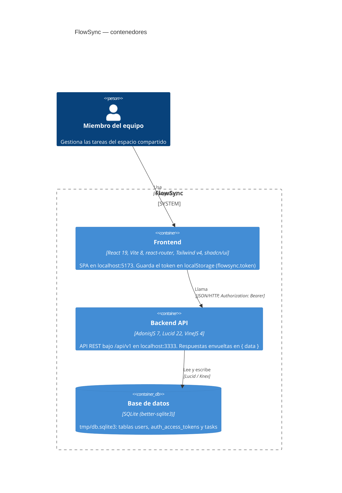
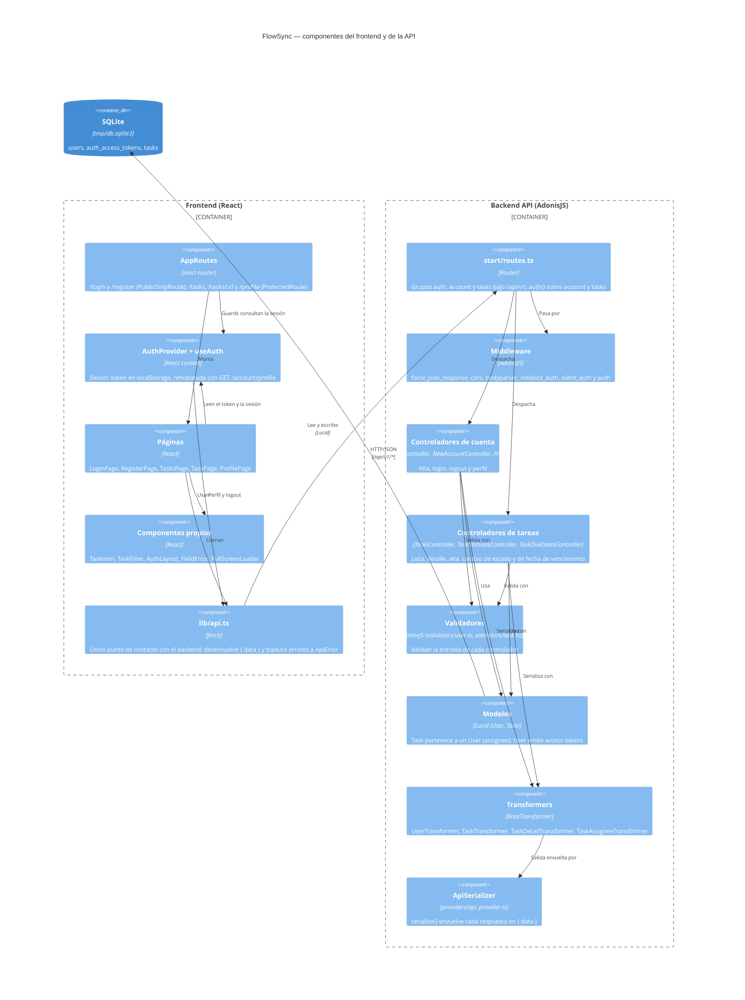

# Arquitectura de FlowSync

Este documento muestra, en dos diagramas C4 escritos en Mermaid, cómo está montado FlowSync hoy. El primero (contenedores) enseña las piezas desplegables y cómo se hablan: una SPA de React, una API AdonisJS y una base de datos SQLite. El segundo (componentes) abre el frontend y la API y enseña sus módulos internos: rutas, controladores, validadores, modelos y transformers por un lado; rutas, guards, páginas y cliente HTTP por el otro. Solo aparece lo que se ha podido verificar leyendo el código (`backend/start/routes.ts`, `backend/app/**`, `backend/config/database.ts`, `frontend/src/**`); lo que no está en el código no se dibuja.

## Diagrama de contenedores

## Diagrama de componentes

## Notas de lectura

- **Rutas de la API** (`backend/start/routes.ts`): `POST /auth/signup`, `POST /auth/login`, `GET /account/profile`, `POST /account/logout`, `GET|POST /tasks`, `GET /tasks/:id`, `PATCH /tasks/:id/status`, `PUT /tasks/:id/due-date`. Todas bajo `/api/v1`; las de `account` y `tasks` exigen sesión.
- **Cada controlador de tareas** usa el transformer que le corresponde: la lista, el alta y el cambio de estado usan `TaskTransformer`; el detalle y la fecha de vencimiento usan `TaskDetailTransformer`. Ambos serializan el responsable con `TaskAssigneeTransformer`.
- Los componentes de `frontend/src/components/ui/` son los generados por shadcn y no se dibujan.
